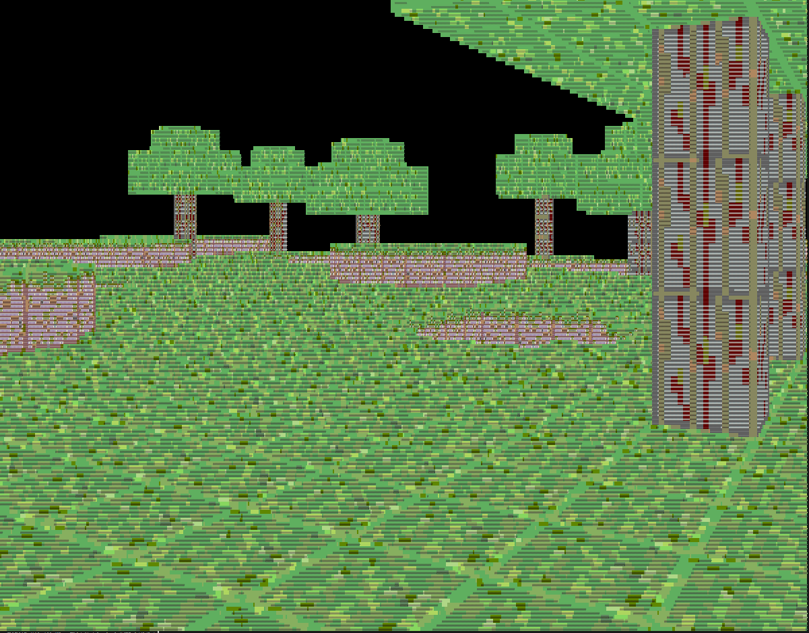
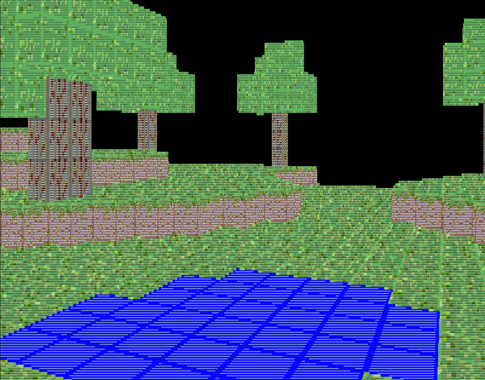
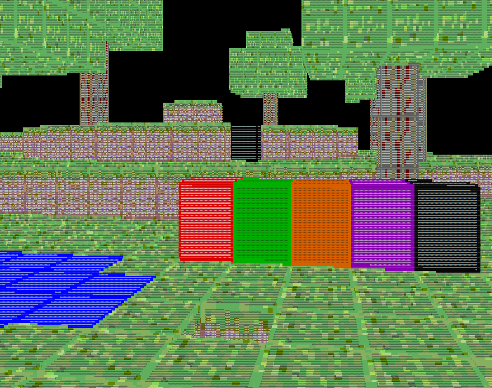

# Minecraft In Terminal

A version of Minecraft that runs entirely in the terminal.

---

## Screenshots





---

## Instructions

### Run in VS Code
This project runs out of the box in the VS Code terminal.

---
### Run in Command Prompt (Windows)

To run this project in the Windows Command Prompt, follow these steps:

1. Add the following line to the **start of your `main` method**:

    ```java
    new ProcessBuilder("cmd", "/c", "color")
        .inheritIO()
        .start()
        .waitFor();
    ```

2. Compile the file.

3. Open **Command Prompt**.

4. Set up the window:
    - Maximize the window (full screen)
    - Right-click the title bar → click **Properties**
    - Go to the **Layout** tab
    - Apply the following settings:
        - Uncheck **Wrap text output on resize**
        - Screen Buffer Size Width: `9000`
        - Window Size Width: `860`
        - Window Size Height: `610`

5. Execute the compiled file.


inspired by : https://github.com/tarantino07/minecraft.c
